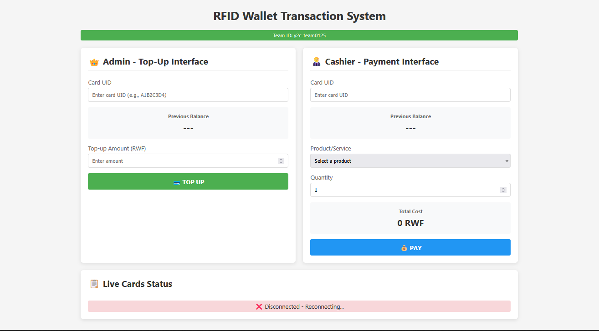

# Virtual Wallet - RFID Transaction System

This project implements a **complete RFID wallet transaction system** using an ESP8266 microcontroller, a cloud backend, and a dual-interface web dashboard. It allows users to **top-up** (Admin) and **make payments** (Cashier) using RFID cards, with real-time balance updates via WebSocket and secure transaction handling.

**Key Features:**

- 💳 **RFID Card Integration** - Scan cards for instant balance retrieval
- 💰 **Dual Interface** - Separate Admin (Top-Up) and Cashier (Payment) dashboards
- 🔄 **Real-Time Updates** - Live balance changes via WebSocket
- 🔒 **Safe Wallet Updates** - Atomic transactions preventing double-spending
- 📊 **Transaction Ledger** - Complete audit trail of all operations
- 🚀 **MQTT Communication** - ESP8266 communicates exclusively via MQTT
- 🌐 **Cloud-Hosted Backend** - VPS running Node.js with SQLite database

---

## System Architecture

```
[ESP8266] ---MQTT---> [MQTT Broker] ---MQTT---> [Backend VPS] ---WebSocket---> [Web Dashboard]
  (RFID Reader)           (benax.rw)           (Node.js + SQLite)               (Browser)
         ^                    ^                       ^                               ^
         |                    |                       |                               |
         |                    |                       |                               |
         +--------------------+-----------------------+-------------------------------+
                      Card Status & Balance Updates          HTTP (Top-up/Pay requests)
```

**Communication Layers:**
- **ESP8266 → MQTT only** (No HTTP/WebSocket)
- **Backend → MQTT, HTTP, WebSocket** (Translates between protocols)
- **Dashboard → HTTP + WebSocket** (Sends requests, receives real-time updates)

---

## Components

### 1. ESP8266 (Edge Controller)
- Reads RFID card UID via MFRC522 module (SPI interface)
- Publishes card status to `rfid/<team_id>/card/status`
- Subscribes to top-up and payment commands:
  - `rfid/<team_id>/card/topup`
  - `rfid/<team_id>/card/pay`
- Publishes balance updates to `rfid/<team_id>/card/balance`

### 2. MQTT Broker (benax.rw)
- Message bus between ESP8266 and backend
- Strict topic isolation using `rfid/<team_id>/` prefix
- Prevents interference between different teams

### 3. Backend API Service (Node.js + Express)
- **HTTP Endpoints:**
  - `POST /api/topup` - Admin top-up requests
  - `POST /api/pay` - Cashier payment requests
  - `GET /api/cards` - List all cards and balances
  - `GET /api/products` - Available products for payment
  - `GET /api/transactions/:uid` - Transaction history
- **MQTT Client:** Publishes commands to ESP8266
- **WebSocket Server:** Real-time dashboard updates
- **SQLite Database:** Cards, products, and transaction ledger

### 4. Web Dashboard (Browser)
- **Admin Interface:**
  - Card UID display
  - Current balance
  - Top-up amount input
  - TOP UP button with success/fail feedback
  
- **Cashier Interface:**
  - Card UID display
  - Current balance
  - Product dropdown (from database)
  - Quantity selector
  - Total cost calculation
  - PAY button with approved/declined feedback

---

## Installation & Setup

### Prerequisites
- Node.js (v14 or higher)
- npm or yarn
- Arduino IDE with ESP8266 support
- MFRC522 RFID module
- ESP8266 board (NodeMCU)

### On ESP8266

1. Open `rfid.ino` in Arduino IDE.
2. Install required libraries:
   - PubSubClient
   - ArduinoJson
   - MFRC522
   - SPI

3. Update configuration:

```cpp
// WiFi Configuration
#define WIFI_SSID "Your_WiFi_SSID"
#define WIFI_PASS "Your_WiFi_Password"

// MQTT Configuration
#define MQTT_HOST "broker.benax.rw"
#define TEAM_ID "y2c_team0125"  // Your team ID

// MQTT Topics (automatically constructed)
// rfid/y2c_team0125/card/status
// rfid/y2c_team0125/card/topup
// rfid/y2c_team0125/card/pay
// rfid/y2c_team0125/card/balance
```

4. Upload to ESP8266 board.
5. Open Serial Monitor (115200 baud) to verify connection.

### On VPS / Backend

1. Copy the web folder to your VPS:

```bash
scp -r web/ user280@157.173.101.159:~/vwallet/
```

2. SSH into your VPS:

```bash
ssh user280@157.173.101.159
cd ~/vwallet/web
```

3. Install dependencies:

```bash
npm install
```

4. Start the backend (using nohup for persistence):

```bash
nohup PORT=9280 node server.js > server.log 2>&1 &
```

5. Verify it's running:

```bash
ps aux | grep node
ss -tln | grep 9280
```

### Web Dashboard Access

- **URL:** `http://157.173.101.159:9280`
- **Admin Panel:** Top-up operations
- **Cashier Panel:** Payment operations
- Real-time updates via WebSocket

---

## API Reference

### HTTP Endpoints

| Method | Endpoint | Description | Request Body | Response |
|--------|----------|-------------|--------------|----------|
| GET | `/api/cards` | List all cards | - | `{ "UID1": balance, "UID2": balance }` |
| GET | `/api/cards/:uid` | Get specific card | - | `{ "uid": "...", "balance": 5000 }` |
| GET | `/api/products` | List products | - | `[{ "id": 1, "name": "Coffee", "price": 500 }]` |
| POST | `/api/topup` | Top-up card | `{ "uid": "...", "amount": 1000 }` | `{ "uid": "...", "newBalance": 6000 }` |
| POST | `/api/pay` | Process payment | `{ "uid": "...", "product_id": 1, "quantity": 2 }` | `{ "uid": "...", "newBalance": 4000, "message": "Payment successful" }` |
| GET | `/api/transactions/:uid` | Transaction history | - | Array of transactions |

### MQTT Topics (Team Isolation)

All topics use namespace: `rfid/y2c_team0125/`

| Topic | Direction | Purpose | Payload Example |
|-------|-----------|---------|-----------------|
| `card/status` | ESP → Backend | Card detected | `{"uid": "A1B2C3D4", "balance": 5000}` |
| `card/topup` | Backend → ESP | Top-up command | `{"uid": "A1B2C3D4", "amount": 1000}` |
| `card/pay` | Backend → ESP | Payment command | `{"uid": "A1B2C3D4", "amount": 500}` |
| `card/balance` | ESP → Backend | Balance updated | `{"uid": "A1B2C3D4", "new_balance": 5500}` |

### WebSocket Events
- **Connection:** Establishes real-time connection
- **Message:** `"refresh"` - Triggers dashboard update

---

## Database Schema (SQLite)

### cards
```sql
CREATE TABLE cards (
  uid TEXT PRIMARY KEY,
  balance INTEGER DEFAULT 0,
  created_at DATETIME DEFAULT CURRENT_TIMESTAMP
);
```

### products
```sql
CREATE TABLE products (
  id INTEGER PRIMARY KEY AUTOINCREMENT,
  name TEXT NOT NULL,
  price INTEGER NOT NULL
);

-- Default products
INSERT INTO products (name, price) VALUES
  ('Coffee', 500),
  ('Sandwich', 1500),
  ('Water', 300),
  ('Juice', 800),
  ('Snack', 400);
```

### transactions
```sql
CREATE TABLE transactions (
  id INTEGER PRIMARY KEY AUTOINCREMENT,
  uid TEXT NOT NULL,
  type TEXT CHECK(type IN ('TOPUP', 'PAYMENT')),
  amount INTEGER NOT NULL,
  previous_balance INTEGER NOT NULL,
  new_balance INTEGER NOT NULL,
  product_id INTEGER,
  quantity INTEGER,
  status TEXT DEFAULT 'SUCCESS',
  created_at DATETIME DEFAULT CURRENT_TIMESTAMP,
  FOREIGN KEY (uid) REFERENCES cards(uid),
  FOREIGN KEY (product_id) REFERENCES products(id)
);
```

---

## Usage Guide

### Admin: Topping Up a Card

1. Navigate to **http://157.173.101.159:9280**
2. In the Admin panel, enter the Card UID (e.g., "A1B2C3D4")
3. View the current balance displayed
4. Enter top-up amount (minimum 100 RWF)
5. Click **"TOP UP"** button
6. Confirmation message shows new balance

### Cashier: Processing a Payment

1. In the Cashier panel, enter the Card UID
2. Verify current balance is displayed
3. Select a product from the dropdown
4. Adjust quantity if needed (total cost updates automatically)
5. Click **"PAY"** button
6. Result shows:
   - ✅ Approved + New balance
   - ❌ Declined + Reason (insufficient funds, card not found)

### Real-Time Updates

- WebSocket connection keeps all connected dashboards in sync
- When any card balance changes, all browsers update automatically
- No page refresh needed

---

## Safe Wallet Implementation

The system ensures **transaction integrity** through database transactions:

```javascript
await db.exec('BEGIN TRANSACTION');
try {
  // 1. Check current balance
  // 2. Update wallet (add or deduct)
  // 3. Record transaction in ledger
  await db.exec('COMMIT');
} catch (error) {
  await db.exec('ROLLBACK');
}
```

This prevents:
- ❌ Partial updates
- ❌ Double-spending
- ❌ Inconsistent balances
- ❌ Lost transactions

---

## Preview



*Dashboard showing Admin Top-Up interface (left) and Cashier Payment interface (right) with live card status table*

---

## Technology Stack

| Component | Technology |
|-----------|------------|
| **Edge Controller** | ESP8266 (NodeMCU) |
| **RFID Reader** | MFRC522 (SPI) |
| **MQTT Broker** | broker.benax.rw |
| **Backend** | Node.js + Express |
| **Database** | SQLite3 |
| **Real-Time** | WebSocket (ws) |
| **Frontend** | HTML5, CSS3, JavaScript |
| **Process Management** | nohup (background execution) |

---

## Project Structure

```
~/vwallet/web/
├── server.js              # Main backend server
├── database.js            # SQLite setup and queries
├── mqttClient.js          # MQTT communication handler
├── package.json           # Dependencies
├── public/                # Frontend files
│   ├── index.html         # Dashboard HTML
│   └── script.js          # Frontend JavaScript
├── wallet.db              # SQLite database (auto-created)
└── server.log             # Server logs (with nohup)
```

---

## Troubleshooting

### Server not responding on port 9280
```bash
# Check if server is running
ps aux | grep node

# Check port
ss -tln | grep 9280

# View logs
tail -50 ~/vwallet/web/server.log

# Restart if needed
pkill -f "node server.js"
cd ~/vwallet/web && nohup PORT=9280 node server.js > server.log 2>&1 &
```

### ESP8266 not connecting to MQTT
- Verify WiFi credentials
- Check MQTT broker address: broker.benax.rw
- Confirm team ID matches topics
- Check Serial Monitor for errors

### WebSocket not updating
- Open browser console (F12) for errors
- Verify WebSocket connection status in dashboard
- Check backend logs for WebSocket errors

### Database issues
```bash
# Check if database exists
ls -la ~/vwallet/web/wallet.db

# Inspect tables
sqlite3 ~/vwallet/web/wallet.db ".tables"

# View products
sqlite3 ~/vwallet/web/wallet.db "SELECT * FROM products;"
```

---

## Team Information

- **Team ID:** y2c_team0125
- **Instructor:** Gabriel Baziramwabo
- **Course:** RFID Systems, IoT Architecture

---

## License

This project is developed for educational purposes as part of the Embedded Systems course.

---

**Live Dashboard:** [http://157.173.101.159:9280](http://157.173.101.159:9280)

*Note: The server runs on port 9280. Ensure this port is accessible from your network.*